## Unicom #Crowd portrayal system

It is a system involved many internet data to category users’ behavior, such as domain & category, ip & location, location & house price.

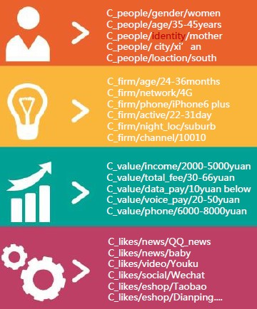

# Unicom #DATA predict

It is a system to recommend users to use the most necessary packages with their phone and their needs for data

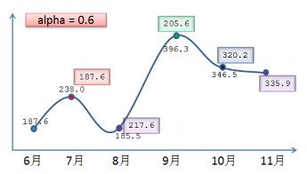

This is the predicted results and real data consumption. The algorithms are as following.

### Basic Rules Time Series

### Factors filter

# Unicom #Offline reports

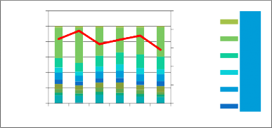

It is a system to generate each month loss users, and analysis its different probabilities.

120.00%

100.00%

80.00%

60.00%

40.00%

20.00%

0.00%

01月 2月 3月 4月 5月 6月

铜川 西安 渭南 汉中 榆林

延安

500000

400000

300000

200000

100000

0

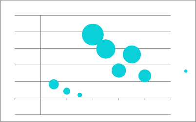

This is the multi-months lose chart. Then you can get the top reasons chart with its significance.

100000

80000

60000

40000

20000

0

-2 0 2 4 6 8 10

-20000

Finally, a group of people loss because of reason 1 in 89%,reason 2 in 66%, and reason 3 in 45%.

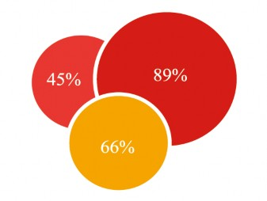

# Ipinyou #DSP DATA

It is a report for DSP Data distribution. First, starting with a sample of DSP data.

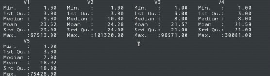

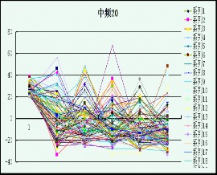

Then, I can category those data with different Variances of domains in 7 days, using basic cluster. And each variance cluster represents one type of DSP data.

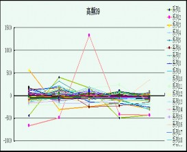

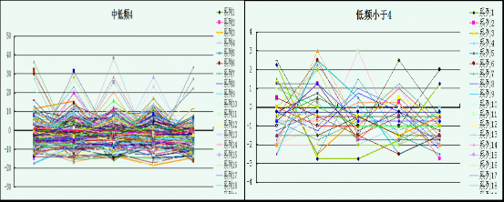

The 1st almost are full of cheating behavior not involved a normal browse.

The 3rd and 4th nearly are some nice domains which are stable markets for online advertising.

# Ipinyou #Association Rules

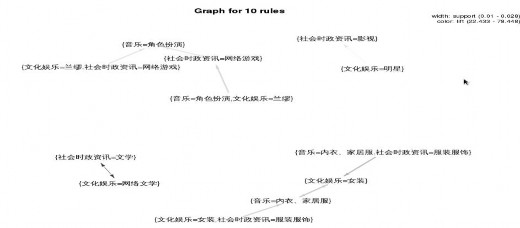

It is a system for discovering users’ interests through a group of people may have some common interests in the probability.

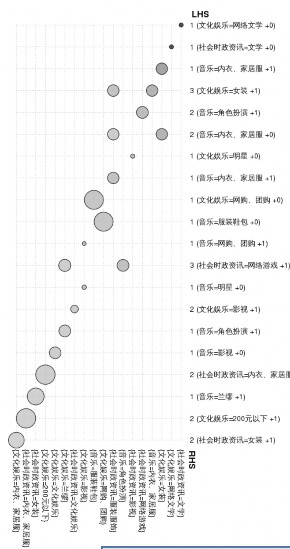

# Knownsec #Domain classify

This is a part of Phishing system, which aims to designate which website is a Phishing link to avoid cheating users. The domain classify is to judge a website to be a certain category. It uses ICTCLAS(a Chinese lexical analysis system ) to form vector, which also uses Bayesian to classify those website.